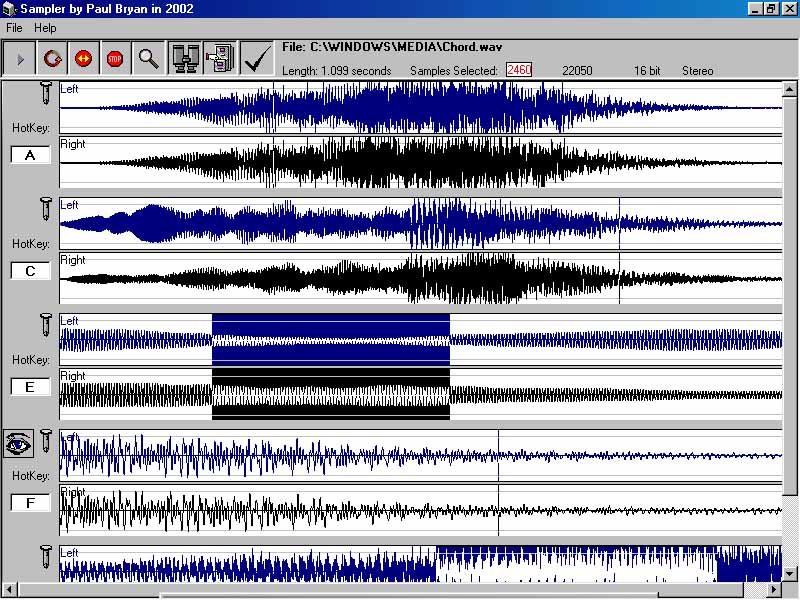



## SampleStudio Beta\-2 \(Updated\)

### Description

This is a completely functional, realtime (on the fly) sampler/sequencer, written in Pure VB! and fully commented. The code allows you to load, save, play, record, select, paste, loop, zoom, and trigger unlimited!, simultaneous! sound samples of ANY Length!, with multiple (mixed) formats. Features: Hotkey Assignments for each sample. Hotkeys are used in combination with <Ctrl> <Alt>, and <Shift> keys, as Triggers for playing, looping, and stopping samples on demand. Saves and loads File & Hotkey Data in 'Sound Bank' files (like a play list), for easy retrieval of prior settings. A Music Source + A Laptop + A Crossfading Mixer + This Program = 'Party waiting to Happen' :) ... The microsoft MCI save command, doesn't save a valid wav file, I still haven't figured out what is going wrong with it, if anyone knows a fix (maybe a service pack "Im using SP3", I dunno), Please let me know! Till then, I've discovered that after recording a sample, and selecting the entire area, Pasting the selection as a new file, seems to fix the Glitch ... go figure!
 
### More Info
 

             |
---                |---
**Submitted On**   |2002-02-15 16:49:46
**By**             |[Zaphod](https://github.com/Planet-Source-Code/PSCIndex/blob/master/ByAuthor/zaphod.md)
**Level**          |Advanced
**User Rating**    |4.9 (54 globes from 11 users)
**Compatibility**  |VB 6\.0
**Category**       |[Complete Applications](https://github.com/Planet-Source-Code/PSCIndex/blob/master/ByCategory/complete-applications__1-27.md)
**World**          |[Visual Basic](https://github.com/Planet-Source-Code/PSCIndex/blob/master/ByWorld/visual-basic.md)
**Archive File**   |[SampleStud554792152002\.zip](https://github.com/Planet-Source-Code/zaphod-samplestudio-beta-2-updated__1-31801/archive/master.zip)

